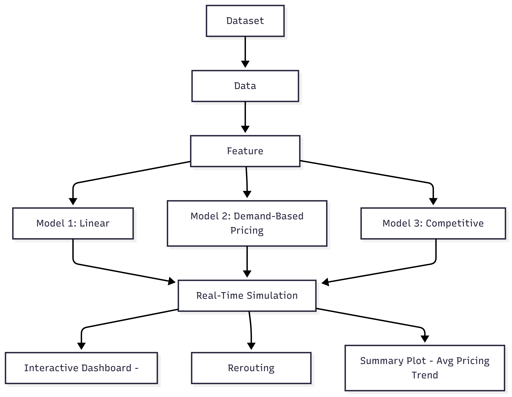
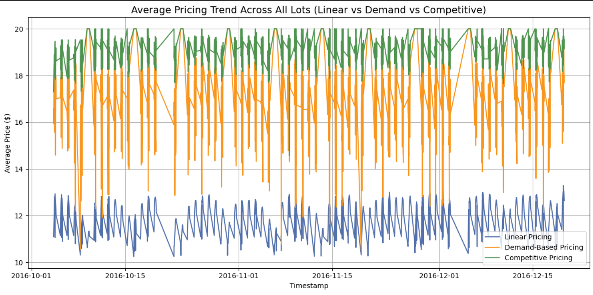
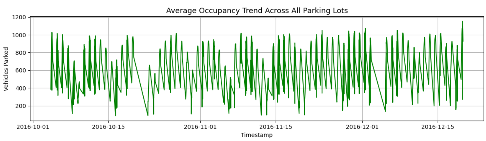

# Dynamic Pricing Engine for Urban Parking Lots

**Capstone Project – Summer Analytics 2025**  
**Author: Anvi Aggarwal**

---

## 📌 Project Overview

This project implements a real-time dynamic pricing engine for 14 urban parking lots using simulated data streams. The system adjusts parking prices based on demand signals, reroutes drivers when lots are full, and provides visual analysis through an interactive dashboard.

---

## Tech Stack

- **Python** (Core)
- **Pandas / NumPy** (Data Handling)
- **Bokeh** (Interactive Visualization)
- **Matplotlib** (Static Plots)
- **Jupyter Notebook**

---

## Architecture Diagram

This diagram shows the full flow from dataset to model output and rerouting decisions.

---

## Pricing Model Comparison

Below is a plot showing how prices change over time for the three models:

- **Model 1**: Linear Pricing (based on occupancy only)  
- **Model 2**: Demand-Based Pricing (adds traffic, queue, events, vehicle type)  
- **Model 3**: Competitive Pricing (adds nearby lot pricing and rerouting)

---

## Features

- 📊 Real-time simulation by timestamp
- 🧠 Three pricing models (Linear, Demand-Based, Competitive)
- 🚦 Traffic and queue-based dynamic pricing
- 📍 Nearby lot rerouting suggestions
- 🖥️ Interactive Bokeh dashboard
- 📉 Summary plot for model evaluation

---

##  Files Included

| File | Description |
|------|-------------|
| `Anvi_SA2025_CAPSTONE.ipynb` | Final notebook with full code and outputs |
| `README.md` | Project overview |
| `screenshots` | Contains architecture diagram and summary plot |
| `dataset.csv` | Dataset used |

---

## 🔓 Repository Access

This repository is public and all outputs are included.  
Notebook has been tested and renders correctly.  

📓 **Note:** If the notebook doesn’t appear properly on GitHub, you can view it here:
- [View on nbviewer](https://nbviewer.org/github/anvi4306/Summer-Analytics-2025_Capstone-Project/blob/main/Anvi_SA2025_CAPSTONE.ipynb)
- [Open in Colab](https://colab.research.google.com/drive/1iw0W8ObNKC_9UhtJMsEkKa_7TU7I6vqO?usp=sharing)

